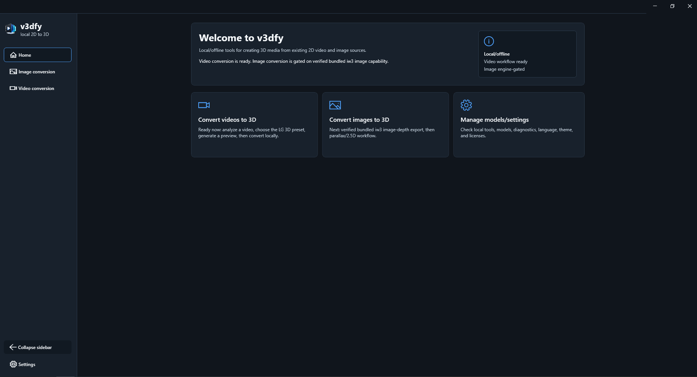
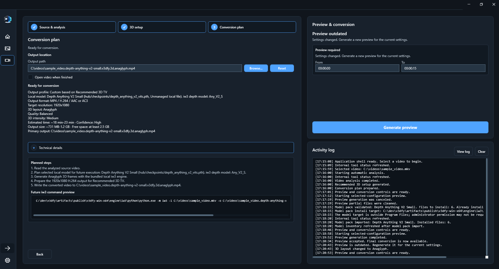
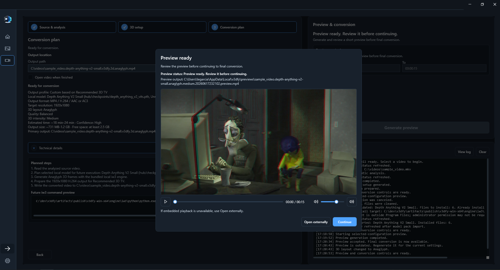
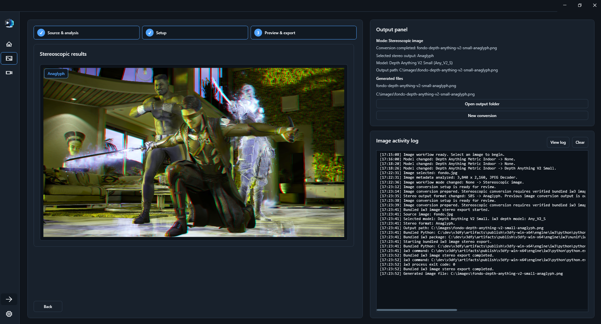
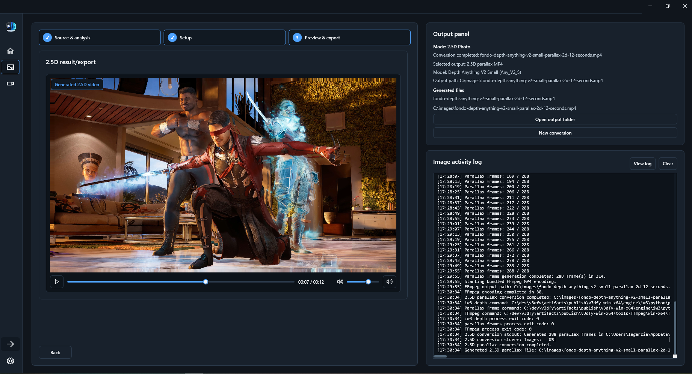
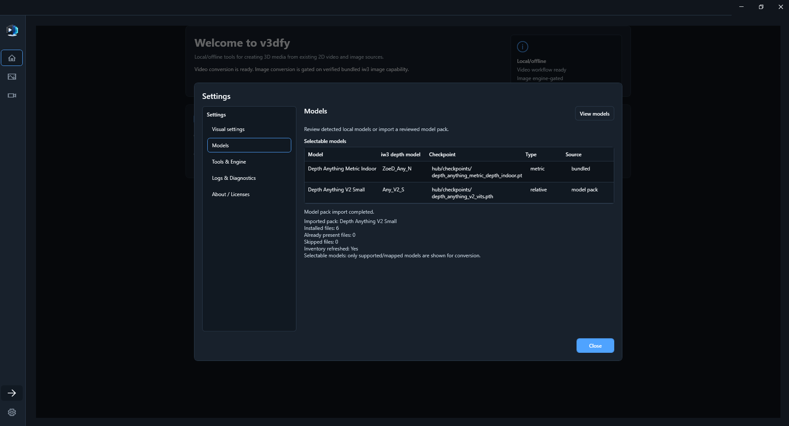

# v3dfy

v3dfy is a Windows desktop app for local/offline 2D-to-3D media conversion. It converts existing video and image sources into 3D outputs using bundled local tools and local AI/depth models.

This is a preview release. The app is built for local workflows, large media files, and review-before-export conversion rather than cloud processing.

## What It Supports

- Video conversion with source analysis, recommended setup, preview review, final conversion, progress, logs, and technical details.
- Image conversion for stereoscopic image export.
- Experimental 2.5D / parallax image-to-video export. Results depend heavily on the source image, depth map quality, and scene structure.
- Local/offline execution with bundled FFmpeg/FFprobe, engine runtime, and model files.
- English and Spanish localization.
- Light and dark themes.
- Activity logs and diagnostic details for troubleshooting.

## Video Conversion

The Video workflow guides an existing 2D video through source selection, analysis, preview generation, review, and final 3D export.

Before running a full conversion, v3dfy can generate a short preview so the setup can be reviewed first.

## Image Conversion

The Image workflow supports still stereoscopic output and experimental 2.5D / parallax motion output from a 2D image. The parallax path is source-dependent and should be treated as experimental rather than equal in reliability to stereoscopic image export or video conversion.

## 3D Output Modes

v3dfy exposes common 3D output forms, including:

- SBS / Side-by-Side
- Half Top-Bottom
- Anaglyph

The exact labels and availability are workflow-specific. Video conversion currently focuses on TV-friendly 3D video formats, while Image conversion exposes stereoscopic image controls and experimental parallax-specific controls.

## Local Models And Offline Tools

Model availability is detected at runtime. The in-app Models view is the authoritative inventory for the current machine because models can come from the reference release payload, imported model packs, or local catalog entries.

The table below is derived from the reference model-pack catalog in this repository. It should be read as the current reference release/catalog set, not as a promise that every installation has every model installed.

| Reference model pack | iw3 depth model | Type | Video | Image | Best use |
| --- | --- | --- | --- | --- | --- |
| Depth Anything V2 Small | `Any_V2_S` | Model pack | Yes | Yes | General movies, animation, quick tests |
| Depth Anything Small | `Any_S` | Model pack | Yes | Yes | Lightweight conversions |
| Distill Any Depth Small | `Distill_Any_S` | Model pack | Yes | Yes | Small distilled model comparisons |
| Depth Anything V2 Metric Hypersim Small | `Any_V2_N_S` | Model pack | Yes | Yes | Indoor metric scenes |
| Depth Anything V2 Metric VKITTI Small | `Any_V2_K_S` | Model pack | Yes | Yes | Outdoor metric scenes |
| Depth Anything Base | `Any_B` | Model pack | Yes | Yes | Balanced v1 conversions |
| Depth Anything V2 Metric Hypersim Base | `Any_V2_N_B` | Model pack | Yes | Yes | Detailed interiors |
| Depth Anything V2 Metric VKITTI Base | `Any_V2_K_B` | Model pack | Yes | Yes | Outdoor base scenes |
| Depth Anything 3 Mono Large | `Any_V3_Mono` / `Any_V3_Mono_01` | Model pack | Yes | Yes | Experimental large model |
| Depth Anything Large | `Any_L` | Model pack | Yes | Yes | Quality-focused v1 output |
| Depth Anything Metric Indoor | `ZoeD_Any_N` | Model pack | Yes | Yes | Rooms, interiors, dialogue scenes |
| Depth Anything Metric Outdoor | `ZoeD_Any_K` | Model pack | Yes | Yes | Streets, landscapes, outdoor footage |

The installed app does not require system Python, system FFmpeg, pip, or first-run model downloads when the offline payload is used. Bundled tools and models are resolved relative to the installation folder.

## Downloads

Releases are published from GitHub Releases. GitHub has a 2 GB per-file asset limit, while the full v3dfy payload is close to 6 GB, so the release payload is split into three parts.

That split is already handled by the installers:

- The web installer downloads the three release payload parts, verifies them, reconstructs the payload, and installs the app.
- The offline installer is intended to be used with the three split payload parts placed beside it.

Release assets are generated in order: publish `artifacts\publish\v3dfy-win-x64`, run `scripts\package-release-payload.ps1`, then run `scripts\package-release-installers.ps1`.

Use the release assets for the matching preview version, for example `vX.Y.Z-preview.N`. The installed app runs locally after installation.

## Requirements

- Windows 10/11 x64.
- Enough disk space for the app payload, model files, temporary working files, and generated outputs.
- Output files can be large, especially video conversions.
- GPU acceleration depends on the bundled engine and the system's available hardware/driver capabilities.

## Project Docs

Technical and packaging details live in the repository docs:

- [Development workflow](docs/development-workflow.md)
- [Packaging](docs/packaging.md)
- [Engine layout](docs/engine.md)
- [Model pack catalog](docs/model-pack-catalog.md)

## AI Assistance Disclosure

This project is developed with AI/Codex assistance under human supervision. Design decisions, code review, validation, and release approval remain human-controlled.
