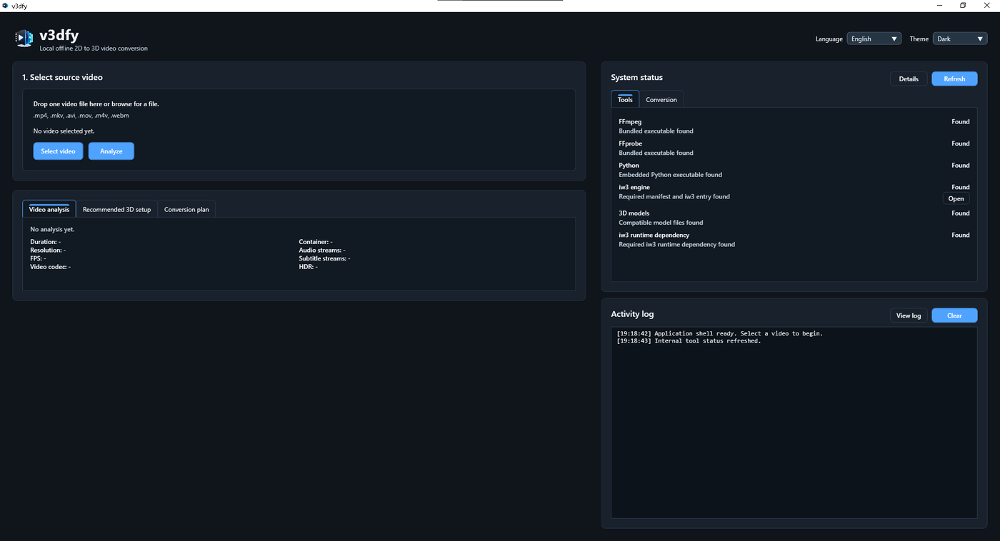
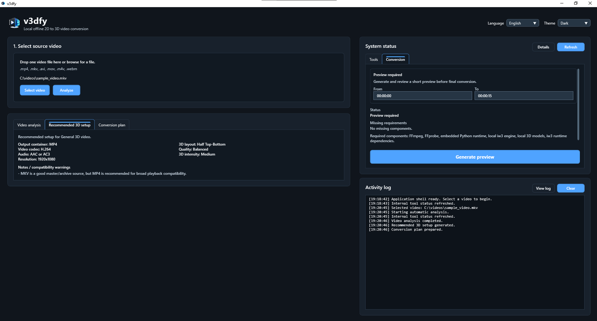
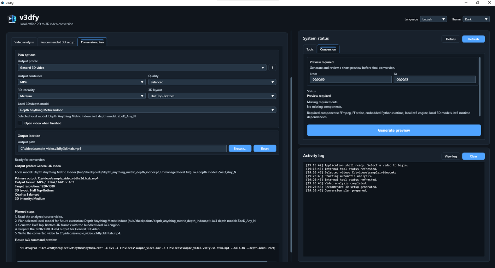
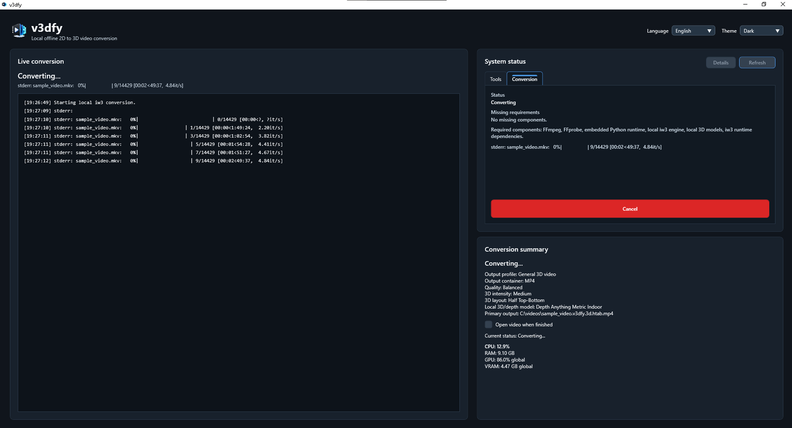
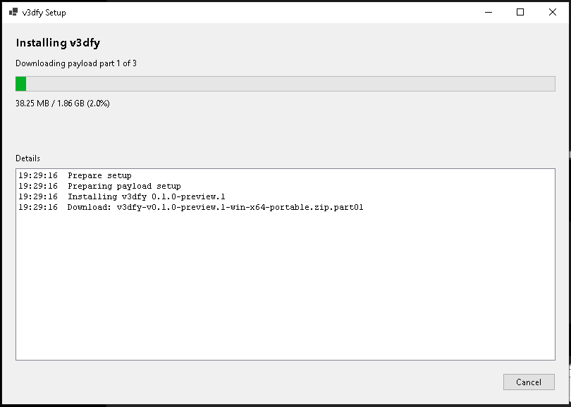
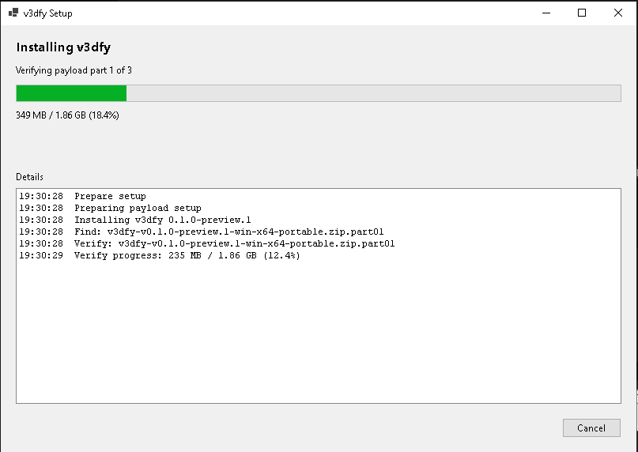

# v3dfy

**v3dfy** is a Windows desktop app for converting regular 2D videos into 3D videos using a local conversion engine.

It is designed for users who want to create 3D video files from their own videos and play them on compatible 3D displays, TVs, or media players.

> Preview release for Windows x64.



---

## Download

Get the latest version from the releases page:

**[Download v3dfy](https://github.com/Henrriegel/v3dfy/releases/latest)**

### Recommended installer

For most users, download only:

```text
v3dfy-v0.1.0-preview.1-web-setup.exe
```

Run the installer and follow the setup wizard.

This installer requires internet during installation. After installation, v3dfy can run locally/offline.

### Offline installer

Use this option if the computer where v3dfy will be installed does not have internet access.

Download all of these files into the same folder:

```text
v3dfy-v0.1.0-preview.1-offline-setup.exe
v3dfy-v0.1.0-preview.1-win-x64-portable.zip.part01
v3dfy-v0.1.0-preview.1-win-x64-portable.zip.part02
v3dfy-v0.1.0-preview.1-win-x64-portable.zip.part03
```

Then run:

```text
v3dfy-v0.1.0-preview.1-offline-setup.exe
```

No PowerShell, manual extraction, or command-line setup is required.

---

## What v3dfy does

v3dfy guides you through a simple 2D to 3D conversion workflow:

1. Select a source video.
2. Analyze the video.
3. Review the recommended 3D setup.
4. Adjust the output options if needed.
5. Generate and review a short preview.
6. Start the final conversion.

Your videos are processed locally on your computer. v3dfy does not upload your videos to a cloud conversion service.

---

## Screenshots

### Analyze your video

v3dfy reads the selected video and shows useful details such as duration, resolution, FPS, codec, audio streams, and container format.


### Review the recommended 3D setup

After analysis, v3dfy prepares a recommended 3D setup for the selected video.



### Adjust the conversion plan

Before converting, you can review the output profile, container, quality, 3D layout, intensity, model, and output location.



### Convert locally

During conversion, v3dfy shows the current progress and status while the video is processed on your computer.



### Installer options

v3dfy provides a recommended web installer and an offline installer option.





---

## Main features

* Local 2D to 3D video conversion
* Guided desktop workflow
* Required preview before final conversion
* MP4 and MKV output options
* Adjustable 3D layout, quality, and intensity
* Video analysis before conversion
* English and Spanish interface
* Light and dark themes
* Live conversion status
* Cancelable conversion
* Installer and uninstaller support

---

## System requirements

* Windows 10 or Windows 11
* 64-bit system
* Enough free disk space for installation and converted videos
* A compatible GPU and updated graphics driver are recommended for better performance

Conversion time depends on your computer, the source video, and the selected settings.

---

## Basic usage

1. Open v3dfy.
2. Click **Select video**.
3. Click **Analyze**.
4. Review the recommended 3D setup.
5. Generate a short preview.
6. Review the preview.
7. Continue to final conversion.
8. Start the conversion.
9. Play the generated 3D video with your preferred compatible player or device.

---

## Output files

v3dfy creates a new 3D video file and does not overwrite your source video.

Example output name:

```text
sample_video.v3dfy.3d.htab.mp4
```

MP4 is recommended for broad playback compatibility. MKV is also available for users who prefer that container.

---

## Privacy

v3dfy is designed to process videos locally on your computer.

Your videos are not uploaded to a cloud conversion service by v3dfy.

The recommended web installer only needs internet during installation so it can download the app package.

---

## Preview release notes

This is an early preview release.

Some videos may convert better than others depending on the source material, motion, lighting, resolution, and selected settings. 3D playback compatibility can also vary by player, display, TV model, firmware, and media format.

For best results, test with a short video first before converting longer videos.

---

## For developers

v3dfy is built with .NET, WPF, C#, and a local conversion runtime.

From the repository root:

```powershell
powershell -NoProfile -ExecutionPolicy Bypass -File .\scripts\build.ps1
powershell -NoProfile -ExecutionPolicy Bypass -File .\scripts\test.ps1
```

Packaging details are available in:

```text
docs/packaging.md
```

---

## License

License information will be provided with the project release and included third-party notices.